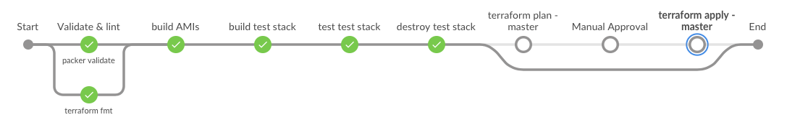
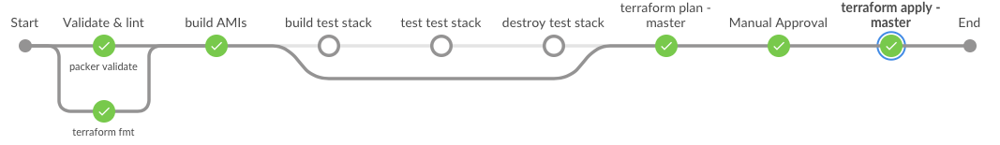

# Real World AWS Packer & Terraform Pipeline

This is a working Jenkinsfile Multibranch Pipeline for building AWS AMI's images & deploying EC2 instances based on the AMI with terraform (in both a per-branch test stack, destroyed by the pipeline, and maintaining production from the master branch).

The pipeline uses 2 docker images to run jobs, most of the work is done in [hashicorp-pipeline](https://hub.docker.com/r/simonmcc/hashicorp-pipeline/), which contains [packer](https://www.packer.io), [terraform](https://www.terraform.io), [aws cli](https://aws.amazon.com/cli/) & some other [needed binaries](https://github.com/simonmcc/hashicorp-pipeline/blob/master/Dockerfile#L3-L4) (jq, perl), the other docker image used is [chef/inspec](https://hub.docker.com/r/chef/inspec/), which is used to test the stack built during non-master pipeline executions.

### Features
* `terraform fmt -check=true -diff=true` used to check terraform config files
* `packer validate` used to validate packer config files 
* `base` and `application` AMI's built and tagged with SHA1 of the `base/base.json` and `app/app.json`, to help prevent unnecessary AMI builds
* Automatically configures terraform remote state (S3 & DynamoDB)
* terraform workspaces used to store per-branch terraform state 
* parameterized terraform build using per-branch tfvars
* `chef/inspec` used to validate AWS resources
* `terraform plan` with stash of plan, human approval, `terraform apply` workflow for master/production changes

### What next to use this in your own project
* Add `demo-aws-creds` credential set (uses [AWS Credentials](https://plugins.jenkins.io/aws-credentials) plugin)
* Update terraform to actually deploy an EC2 instance (for demo purposes, this only builds a VPC, so zero cost & quick cycle time for pipeline experimentation, trivial to add an EC2 instance)
* Use AWS Auto Scaling group to replace running EC2 instances with EC2 instances built from the master branch `app` AMI
* Use AMI tags to ensure `app` AMI matches the branch (Use the SHA1 of `app/app.json` to search for the AMI in terraform, requires some tfvars templating/injection) 
* Extend `chef/inspec` stage to test AWS EC2 
* Add a Selenium or other web test stage

If you want a simple dockerized Jenkins setup to host this, I used [Jenkins 201](https://github.com/jenkins201/jenkins-container), there's also example Job DSL [here](https://github.com/jenkins201/jenkins-container/blob/master/jobs/packer_terraform.groovy).

### Further info
Some of the scripts in this pipeline ([build.sh](scripts/build.sh) & [common.sh](scripts/common.sh)) are based on an incomplete [packer/AMI](https://github.com/CircleCI-Public/circleci-packer) example from [CircleCI]( 
https://circleci.com/blog/how-to-build-immutable-infrastructure-with-packer-and-circleci-workflows/).

